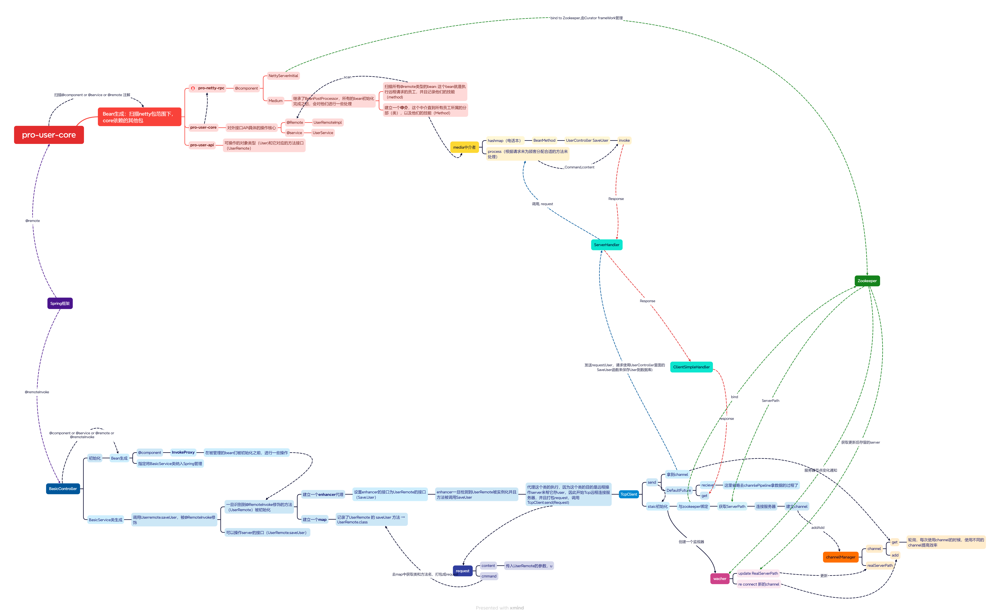

# Spring-Netty-ZooKeeper 轻量级 RPC 通信系统

## 项目概述

**Spring-Netty-ZooKeeper** 是一款面向分布式环境的轻量级 **RPC 通信系统**，核心技术栈整合 **Spring 框架**、**Netty 网络通信**、**ZooKeeper 服务协调** 与 **Curator 客户端**，旨在解决分布式场景下服务间的 **高效远程调用**、**动态服务管理** 与 **智能负载均衡** 问题。  

系统支持以下特性：
- 服务动态上下线感知  
- 按权重分配请求的负载均衡机制  
- 多线程数据安全控制  

适用于微服务架构中跨节点的服务交互场景（如用户数据远程存储、业务逻辑跨服务调用等）。

## 项目前置版本与演进过程

项目包含两个前置演进版本，逐步构建核心 RPC 能力：

### 1. **pro-netty-rpc - Non-Spring-Simple-Version**
基础版本，仅实现 Netty 客户端与服务端的简单通信：  
通过手动编写 Netty 处理器（Handler）完成 TCP 连接建立、数据编解码及同步消息交互，不依赖 Spring 框架。  
核心逻辑为 **“客户端发送字符串指令 → 服务端接收并返回固定响应”**，  
是后续分布式 RPC 的网络通信基础。

---

### 2. **pro-netty-rpc - 用 command 实现简单的中介者模式 (9-12)**
进阶版本，引入 **命令（Command）+ 中介者（Medium）** 模式：  
服务端通过 `command` 标识区分不同请求类型（如 `USER_SAVE`、`USER_QUERY`），并由 `Medium` 类统一分发请求到对应业务处理逻辑，初步实现请求与处理的解耦。  
此版本未引入动态代理，客户端需手动构建包含 command 的请求对象，是后续 Spring 代理与分布式能力的过渡版本。

---

### 3. **核心版本：分布式 RPC 系统最终实现**
整合 **Spring、ZooKeeper/Curator、动态代理** 等技术，实现完整的分布式 RPC 能力：  
- 支持服务自动注册与发现；  
- 基于动态代理简化远程调用；  
- 支持权重负载均衡；  
- 自动感知服务上下线。  

是整个项目的核心实现版本。

---

### 系统架构图



## 核心技术栈与选型优势

| 技术组件 | 核心作用 | 选型优势 |
|-----------|-----------|-----------|
| **Spring 框架** | 组件管理、注解驱动开发、代理拦截 | 1. 通过 IOC 容器统一管理 RPC 客户端 / 服务端组件，降低耦合；<br>2. 基于自定义注解 `@Remote` 和 `@RemoteInvoke` 实现请求拦截与代理，简化远程调用逻辑；<br>3. 支持 Bean 生命周期管理，确保组件初始化与销毁的安全性。 |
| **Netty 网络框架** | 客户端 - 服务端通信连接、数据传输 | 1. 基于 NIO 模型，支持高并发、低延迟的网络通信，单线程可处理千级连接；<br>2. 配合 JSON 序列化实现自定义 RPC 协议（请求头 + 命令 + 参数的 JSON 字符串传输）；<br>3. 支持连接池管理，避免频繁创建 / 销毁连接导致的资源浪费。 |
| **ZooKeeper + Curator** | 服务注册与发现、动态上下线通知 | 1. ZooKeeper 提供分布式协调能力，存储服务端地址与权重信息；<br>2. Curator 封装 ZooKeeper 底层 API，简化节点创建、监听、会话管理等操作，解决原生 API 繁琐、异常处理复杂等问题；<br>3. 通过 Curator 的 Watcher 机制实现服务动态感知，服务端上下线时客户端自动更新连接。 |
| **JSON 序列化** | 数据格式转换（对象→字符串） | 采用轻量 JSON 格式（FastJSON 实现），简化请求 / 响应数据的序列化与反序列化，避免二进制协议的复杂度，适合中小规模分布式场景。 |
| **CGLIB 动态代理** | 客户端远程调用代理实现 | 基于字节码生成技术，为接口创建动态代理对象，拦截远程方法调用并自动封装为 RPC 请求，无需手动编写网络通信代码。 |

---


## 系统核心功能与实现逻辑

### 1. 远程调用流程（客户端 - 服务端交互）
系统采用 “注解驱动 + 反射调用” 实现远程方法调用，以 “用户数据存储（saveUser）” 为例，完整流程如下：

#### （1）客户端：基于 @RemoteInvoke 的代理调用

**Step 1：通过 @RemoteInvoke 标记远程服务接口**

客户端在服务接口字段上添加 @RemoteInvoke 注解，Spring 会自动为该接口创建动态代理，拦截所有方法调用：
```java
@Service
public class BasicService {
    // @RemoteInvoke 标记：Spring 会为 UserRemote 创建代理对象
    @RemoteInvoke
    private UserRemote userRemote;
    
    public void testSaveUser() {
        // 创建用户对象
        User u = new User();
        u.setId(1);
        u.setName("李四");
        // 调用远程方法（实际被代理拦截，发送 RPC 请求）
        Object response = userRemote.saveUser(u);
        // 打印服务端响应结果
        System.out.println(JSONObject.toJSONString(response));
    }
}
```

**Step 2：代理拦截并封装 RPC 请求**

当调用 `userRemote.saveUser(u)` 时，代理会自动封装请求信息（包含接口名、方法名、参数），通过 Netty 发送到服务端。请求格式示例（JSON 序列化后）：

```json
{
  "id": "123456",
  "command": "com.dxfx.user.remote.UserRemote.saveUser",
  "content": {"id":1, "name":"李四"}
}
```
***代理的实现 扫描注解并生成代理***


InvokeProxy 实现 Spring 的 BeanPostProcessor，在客户端 Bean 初始化前扫描带有 @RemoteInvoke 的字段，为其生成 CGLIB 代理对象：


```java
@Component
public class InvokeProxy implements BeanPostProcessor{

    @Override
    public Object postProcessBeforeInitialization(Object bean, String beanName) throws BeansException {
        // 扫描当前 Bean 中所有字段
        Field[] fields = bean.getClass().getDeclaredFields();
        for(Field field : fields) {
            // 处理带 @RemoteInvoke 注解的字段（如 UserRemote）
            if(field.isAnnotationPresent(RemoteInvoke.class)) {
                field.setAccessible(true); // 允许修改私有字段
                
                // 存储“方法-接口”映射（用于生成调用命令）
                final Map<Method, Class> methodClassMap = new HashMap<>();
                putMethodClass(methodClassMap, field); // 初始化映射关系
                
                // CGLIB 增强器：为接口生成代理对象
                Enhancer enhancer = new Enhancer();
                enhancer.setInterfaces(new Class[] {field.getType()}); // 代理接口（如 UserRemote.class）
                
                // 设置代理回调：拦截方法调用
                enhancer.setCallback(new MethodInterceptor() {
                    @Override
                    public Object intercept(Object instance, Method method, Object[] args, MethodProxy proxy)
                            throws Throwable {
                        // 1. 封装 RPC 请求
                        ClientRequest request = new ClientRequest();
                        // 生成命令：接口全类名 + 方法名（如 "com.dxfx.user.remote.UserRemote.saveUser"）
                        request.setCommand(methodClassMap.get(method).getName() + "." + method.getName());
                        request.setContent(args[0]); // 请求参数（如 User 对象）
                        
                        // 2. 通过 Netty 客户端发送请求
                        Response resp = TcpClient.send(request);
                        return resp; // 返回服务端响应
                    }
                });
                
                // 3. 为字段设置代理对象（替换原始接口引用）
                try {
                    field.set(bean, enhancer.create());
                } catch (Exception e) {
                    e.printStackTrace();
                }
            }
        }
        return super.postProcessBeforeInitialization(bean, beanName);
    }
    
    // 初始化“方法-接口”映射（如 saveUser 方法 → UserRemote 接口）
    private void putMethodClass(Map<Method, Class> methodClassMap, Field field) {
        Method[] methods = field.getType().getDeclaredMethods();
        for(Method m : methods) {
            methodClassMap.put(m, field.getType());
        }
    }

}
```
#### （2）服务端：基于 @Remote 与 Medium 中介者模式处理请求

服务端通过 @Remote 标记可被远程调用的实现类，由 InitialMedium 初始化方法映射，最终通过 Media 反射调用业务逻辑。

**Step 1：服务端实现类标记 @Remote**
```java
// @Remote 标记：声明该类方法可被远程调用
@Remote
public class UserRemoteImpl implements UserRemote{
    @Resource
    private UserService userService;
    
    public Object saveUser(User user) {
        userService.save(user);
        return ResponseUtil.createSuccessResult(user);
    }
    
    public Object saveUsers(List<User> users) {
        userService.saveList(users);
        return ResponseUtil.createSuccessResult(users);
    }
}
```

**Step 2：InitialMedium 初始化方法映射表**

```java
@Component
public class InitialMedium implements BeanPostProcessor{
    @Override
    public Object postProcessAfterInitialization(Object bean, String beanName) throws BeansException {
        if(bean.getClass().isAnnotationPresent(Remote.class)) {
            Method[] methods = bean.getClass().getDeclaredMethods();
            for(Method m : methods) {
                String key = bean.getClass().getInterfaces()[0].getName() + "." + m.getName();
                BeanMethod beanMethod = new BeanMethod();
                beanMethod.setBean(bean);
                beanMethod.setMethod(m);
                Media.beanMap.put(key, beanMethod);
            }
        }
        return bean;
    }
}
```

**Step 3：Media 反射调用业务方法**

```java
public class Media {
    public static Map<String, BeanMethod> beanMap;
    static {
        beanMap = new HashMap<>();
    }

    private static Media instance = null;
    private Media() {}
    public static Media getInstance() {
        if (instance == null) {
            instance = new Media();
        }
        return instance;
    }

    public Response process(ServerRequest request) {
        Response result = null;
        try {
            String command = request.getCommand();
            BeanMethod beanMethod = beanMap.get(command);
            if (beanMethod == null) {
                System.out.println("未找到对应方法：" + command);
                return null;
            }
            Object bean = beanMethod.getBean();
            Method method = beanMethod.getMethod();
            Class<?> paramType = method.getParameterTypes()[0];
            Object content = request.getContent();
            Object args = JSONObject.parseObject(JSONObject.toJSONString(content), paramType);
            result = (Response) method.invoke(bean, args);
            result.setId(request.getId());
        } catch (Exception e) {
            e.printStackTrace();
        }
        return result;
    }
}
```

### 2. ZooKeeper 服务管理与负载均衡

**（1）服务注册与发现**
- 服务端启动时，将自身 IP、端口及权重信息（如 `192.168.1.100#8080#5`）注册到 ZooKeeper 的 `/rpc/services` 节点下；
- 客户端监听该节点，动态维护服务列表。

**（2）动态上下线感知**
- 服务端下线触发 Watcher，客户端自动移除无效节点；
- 新节点上线时，客户端自动建立连接。

**（3）权重负载均衡**
- 根据权重生成地址池，按比例随机分配请求。

### 3. 数据序列化与多线程安全
- **JSON 序列化**：采用 FastJSON 进行请求 / 响应的序列化与反序列化。
- **多线程安全**：
  - Media.beanMap 通过单例 + Spring 管理保证线程安全；
  - Netty 使用主从 Reactor 模型；

## 快速启动与测试

1. 环境项目配置如下

| 项目组件 | 我的版本 |
|-----------|-----------|
| **JDK** | 11 |
| **Maven** | 3.6+ |
| **ZooKeeper** | 3.8.4 |
| **Curator** | 5.7.1 |
| **Spring** | 5.3.24 |
| **Netty** | 4.2.6.Final |


2. 启动步骤
启动ZooKeeper Server

启动服务器端， 运行 - 分布式RPC\pro-user-core2\src\main\java\com\dxfx\server\SpringServer.java

启动客户端，运行 - 分布式RPC\pro-basic\src\main\java\com\dxfx\pro_basic\controller\BasicController.java

## 参考资料
- 项目视频笔记：https://anu365-my.sharepoint.com/personal/u7439250_anu_edu_au/_layouts/15/Doc.aspx?sourcedoc={a60ec8d3-9b40-475e-8c78-3c864819d8b4}&action=edit&wd=target%28%E9%A1%B9%E7%9B%AE.one%7C%2FMaven%7C045c9492-543e-4315-92fb-8ee4aec85947%2F%29&wdorigin=NavigationUrl
